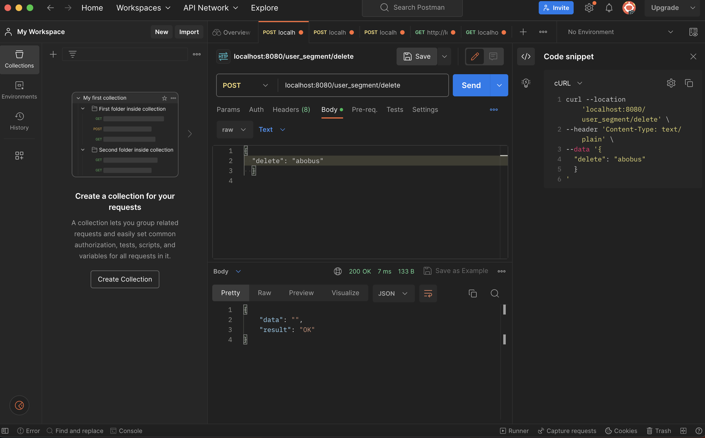

# AVITO TEST BACKEND

Этот проект представляет собой backend-часть для тестового задания Avito.

## Запуск проекта
Проект может быть запущен локально с использованием Docker и Docker Compose.

## Требования
 - Docker
 - Docker Compose 
 
## Запуск

1) Склонируйте репозиторий:
   git clone https://github.com/dreamcoiI/avito_test_backend.git
2) Соберите и запустите контейнеры Docker:
   docker-compose up -d --build  
3) API будет доступно по адресу http://localhost:8080.

## Примеры запросов
### Создание сегмента
 - localhost:8080/user_segment/create
 - 

### Удаление сегмента
- localhost:8080/user_segment/delete

### Добавление и удаление пользователя из сегмента

- localhost:8080/user_segment/add_segment

### Получение сегментов пользователя 

- localhost:8080/user_segment/find

